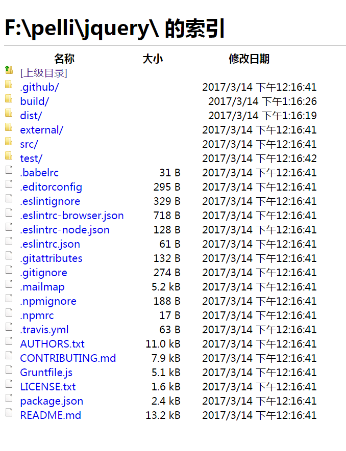

## jQuery源码目录结构  

```
|--- jquery/  
    |--- .github/  
    |   |--- ISSUE_TEMPLATE.md  
    |   |--- PULL_REQUEST_TEMPLATE.md
    |--- build/  
    |   |--- release/  
    |   |   |--- cdn.js
    |   |   |--- dist.js
    |   |   |--- ensure-sizzle.js
    |   |--- tasks/  
    |   |   |--- lib/  
    |   |   |   |--- spawn_test.js
    |   |   |--- build.js
    |   |   |--- dist.js
    |   |   |--- node_smoke_test.js
    |   |   |--- promises_aplus_tests
    |   |   |--- sourcemap.js
    |   |   |--- testswarm.js
    |   |--- release.js
    |--- dist/  
    |   |--- .eslintrc.json  
    |--- external/  
    |   |--- npo/  
    |   |   |--- npo.js  
    |   |--- qunit/ 
    |   |   |--- qunit.js  
    |   |   |--- qunit.css  
    |   |   |--- LICENSE.txt  
    |   |   |--- MIT-LICENSE.txt  
    |   |--- qunit-assert-step/
    |   |   |--- qunit-assert-step.js  
    |   |   |--- MIT-LICENSE.txt  
    |   |--- requirejs/  
    |   |   |--- require.js    
    |   |--- sinon/  
    |   |   |--- LICENSE.txt
    |   |   |--- sinon.js    
    |   |--- sizzle/
    |   |   |--- dist/  
    |   |   |   |--- sizzle.js  
    |   |   |   |--- sizzle.min.js    
    |   |   |   |--- sizzle.min.map    
    |   |   |--- LICENSE.txt    
    |--- src/  
    |   |--- ajax/    
    |   |--- attributes/  
    |   |--- css/  
    |   |--- data/  
    |   |--- deferred/   
    |   |--- effects/  
    |   |--- event/  
    |   |--- exports/  
    |   |--- manipulation/  
    |   |--- queue/  
    |   |--- traversing/  
    |   |--- var/  
    |   |--- .eslintrc.json  
    |   |--- ajax.js  
    |   |--- attributes.js
    |   |--- core.js
    |   |--- css.js   
    |   |--- data.js   
    |   |--- deferred.js   
    |   |--- dimensions.js   
    |   |--- effects.js   
    |   |--- event.js   
    |   |--- jquery.js   
    |   |--- manipulation.js   
    |   |--- offset.js   
    |   |--- queue.js   
    |   |--- selector-native.js   
    |   |--- selector.js  
    |   |--- serialize.js
    |   |--- traversing.js
    |   |--- wrap.js
    |   |--- wrapper.js
    | test/  
    |   |--- data/  
    |   |   |--- ajax/
    |   |   |--- core/
    |   |   |--- css/
    |   |   |--- data/
    |   |   |--- ...
    |   |   |--- support/
    |   |   |--- atom+xml.php  
    |   |   |--- badjson.js
    |   |   |--- ...
    |   |   |--- ...
    |   |   |--- with_fries_over_jsonp.php  
    |   |--- integration/  
    |   |   |--- data/
    |   |   |--- gh-1764-fullscreen.html
    |   |   |--- gh-2343-ie-radio-click.html
    |   |--- node_smoke_tests/  
    |   |   |--- lib/
    |   |   |--- .eslintrc.json  
    |   |   |--- document_mussing.js  
    |   |   |--- document_passed.js  
    |   |   |--- document_presend_originally.js  
    |   |   |--- iterable_with_native_symbol.js  
    |   |   |--- iterable_with_symbol_polyfill.js  
    |   |--- promises_aplus_adapters/  
    |   |   |--- .eslintrc.json  
    |   |   |--- deferred.js
    |   |   |--- when.js  
    |   |--- unit/  
    |   |   |--- ajax.js  
    |   |   |--- animation.js  
    |   |   |--- ...
    |   |   |--- ...
    |   |   |--- tween.js
    |   |   |--- wrap.js
    |   |--- .eslintrc.json  
    |   |--- delegatetest.html  
    |   |--- hovertest.html
    |   |--- index.html  
    |   |--- jquery.js  
    |   |--- localfile.html  
    |   |--- networkerror.html  
    |   |--- readywait.html  
    |   |--- xhtml.php 
    |--- README.md
    |--- .gitignore
    |--- .babelrc
    |--- .editorconfig
    |--- .eslintignore
    |--- .eslintrc-browser.json
    |--- .eslintrc-node.json
    |--- .eslintrc.json
    |--- .gitattributes.json
    |--- .mailmap
    |--- .npmignore
    |--- .npmrc
    |--- .travis.yml
    |--- AUTHORS.txt
    |--- CONTRIBUTEING.md
    |--- Gruntfile.js
    |--- LICENSE.txt
    |--- package.json
 
```

可以看到，jQuery项目根目录下一共有6个文件夹，还有其他文件



```
|--- /
    |--- .github/
    |--- build/
    |--- dist/
    |--- external/
    |--- src/
    |--- test/
    |--- README.md
    |--- package.json
    |--- Gruntfile.js
    |--- ...
    |--- ...
    |--- ...
    |--- ...
```

文件夹作用说明：

* **.github/**:存放关于在github上正确提交issue和pull-request的模板文件。如果你想为jQuery做贡献或者有什么问题，可以使用该文件夹下面的模板文件的格式进行描述，然后提交给jQuery项目组  
* **build/**:存放跟项目构建有关的代码
* **dist/**:项目通过构建工具最终发布产品的位置。当项目通过构建工具构建成功之后，这个文件夹下面会生成最终的产品，jquery.js,jquery.min.js和jquery.min.map  
* **external/**:存放项目中用到的其他库、框架、工具等。  
* **src/**:这个文件夹是jQuery源码所在的地方。也就是这个项目的核心代码。我们jQuery源码阅读项目，主要就是理解该文件夹下面所有的内容。  
* **test/**:该文件夹下是存放和测试有关的内容。包含单元测试，冒烟测试等。一个成熟的项目，必须经过测试。未经测试的项目，对于每个程序员来说，使用起来，心里都是七上八下，异常忐忑。所以基本上也没有人使用未经测试的代码。

jQuery项目根目录下的文件说明：

* **README.md**
* Gruntfile.js
* **package.json**
* .npmignore
* .npmrc
* .babelrc
* .editorconfig
* .eslintignore
* .eslintrc-browser.json
* .eslintrc-node.json
* .eslintrc.json
* .gitattributes.json
* .gitignore
* .travis.yml
* .mailmap
* AUTHORS.txt
* CONTRIBUTEING.md
* LICENSE.txt

### README.md文件说明

通常情况下，当前的开源项目都托管到著名的项目托管网站[https://www.github.com](https://www.github.com)上，配合强大的版本控制工具git，在github上托管项目给我们程序员带来的极大的便捷。

一般来说，我们在github上创建一个项目(create responsitory)的时候，会让你选择是否自动创建README.md文件。这个是可选的，但是按照惯例，项目中会存在这个文件。所以建议选择自动创建这个文件。

这个文件是干嘛的呢？首先这个文件名字是readme,也就是read me。即使是英文小白，翻译这个也就瞟一下子的事：读我。意思是使用之前先看看我。双击666。

这个文件是自述文件，一般是对这个项目的描述，比如说这个项目是用来干嘛的，是怎么使用的，有什么要注意的等等。你作为项目的主人，可以想写什么就写什么，哪怕你写一个hello world呢，也都是可以的。不过既然是自述文件，还是建议认真对待这个readme.md.  

另外说一句，这个文件是需要使用markdown格式来写的，github网站自带markdown格式解析功能。如果你想快速学习markdown格式，请参考我的一个markdown格式仓库：[markdown学习](http://www.github.com/pelligit/markdown-document)。如果你想详细了解markdown是什么，请上搜索引擎自行搜索相关内容。

### package.json文件说明

现在的前端项目基本上都使用node和npm进行搭建和管理，如此一来，项目中必然会有package.json文件，该文件是对整个项目的说明。其中保存了项目的基本信息，对其他包或者模块的依赖等。

可以发现，**README.md** 和 **package.json** 都是对这个项目的描述，不过package.json文件是给计算机看的，readme.md文件是给人看的。package.json的格式是严格的，readdme.md文件的描述方法是自由松散的。  

如果你的电脑上已经安装了node和npm，当你进入一个文件夹后，通过命令行，直接`npm init`，按照提示一直往下执行，你就会发现文件夹中会多了一个文件：package.json.

如果你不懂node和npm，请阅读朴灵的node名著：《深入浅出Node.js》，或者去搜索引擎自行搜索node、npm这两个关键词。当你了解了node和npm之后，你就会对package.json文件很熟悉。

### Gruntfile.js说明  

该项目中有一个文件：Gruntfile.js.存在这个文件，是因为该项目使用了grunt这个构建工具。只要是想要使用grunt构建项目，项目的根目录下一定要有Gruntfile.js这个文件，该文件和package.json文件在同一级。

grunt是什么？grunt是一个构建工具。关于构建工具，我会单独开一个专题进行总结。请查看该项目中`/help/workflow-toolkit/`中的各文章。学习构建工具，要对node有一些了解才行。

这里简单说几句。

为什么使用构建工具？为的使前端工作流中除了写核心业务外的工作自动化。自动化有很多好处，最核心的一点是，减少出错。当然，还有节省时间，提升效率等等。

构建工具能做什么？很多啦。最常听到的，打包压缩。构建工具远不止打包压缩这两个功能这么简单。

* 比如自动化编译，将es6自动转es5,将coffee转js，将stylus转css，将less转css等。
* 创建雪碧图，项目中的小图片太多了，通过构建将小图片合并成合适的雪碧图。
* 自动部署，一键发布。
* 管理git提交信息。

总之功能很多啦。

构建工具有哪些？grunt啊，哈哈。当然还有其他的。gulp也是一个。如果jQuery项目使用的gulp构建的话，这个文件夹下面就会有一个gulpfile.js了。还有fis3，fis3是百度的fis团队的一款作品，如果使用fis构建的话，该文件夹下就会有一个fis.conf.js文件了。还有其他的。构建工具这玩意儿，大家用上了就回不去了。用了都说好。

### .gitignore文件说明

我们来把这个词拆开来看git ignore。

ignore是忽略的意思。字面上看，是git忽略。其实真正的意思也差不多。这个文件是用来配置git忽略的文件或者文件夹的。也就是说，在这个文件中进行配置过的文件或者文件夹，在用户进行修改的时候，不会在git中留下记录。

为什么会有这个

那么有哪些文件不用在git中留下记录呢？