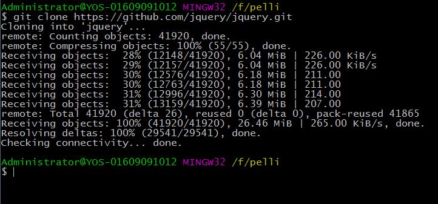
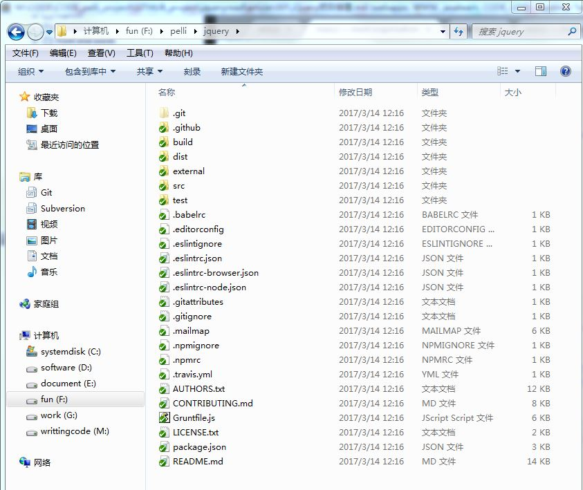
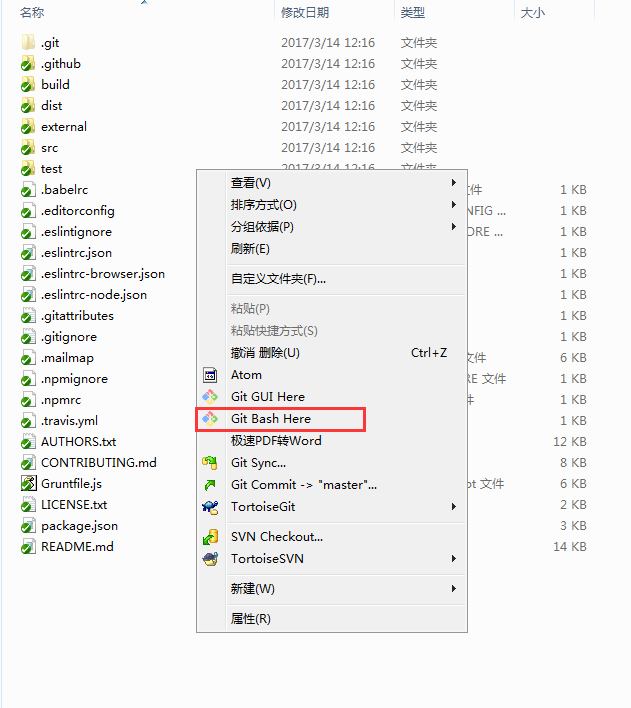
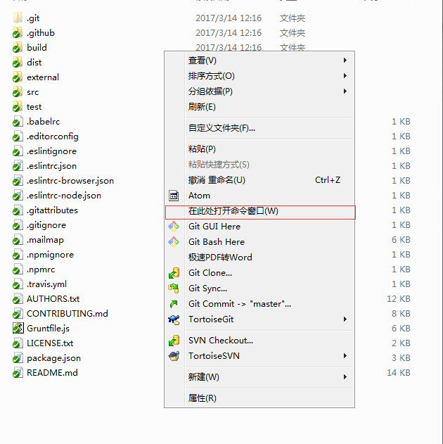
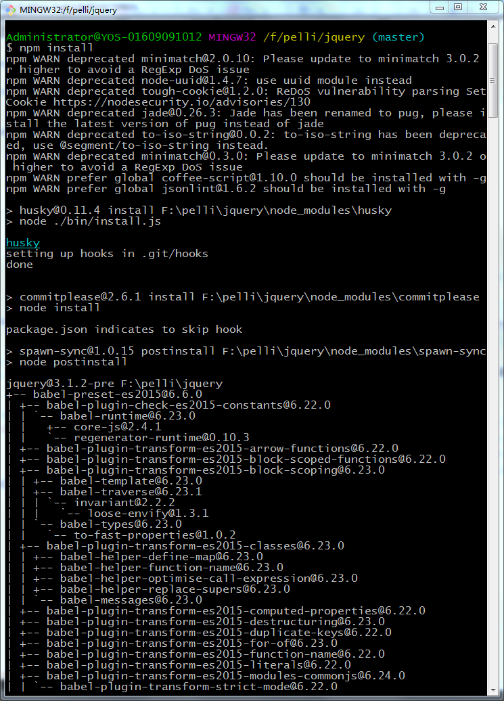
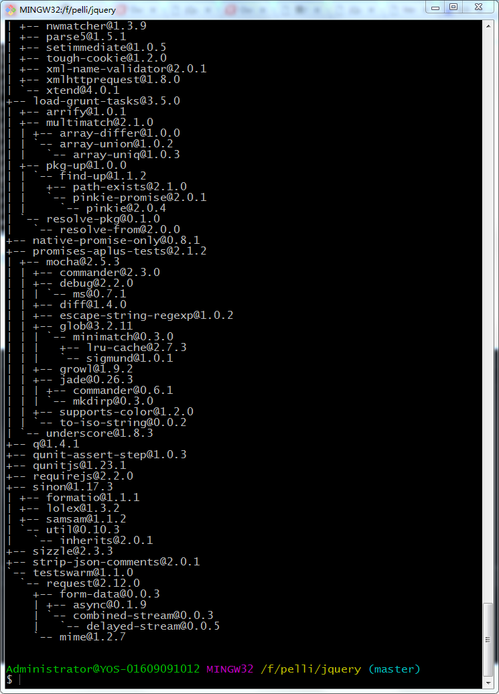
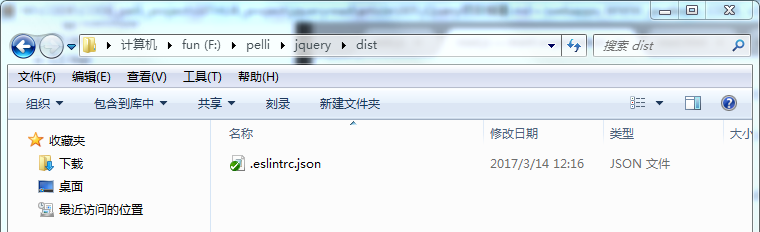
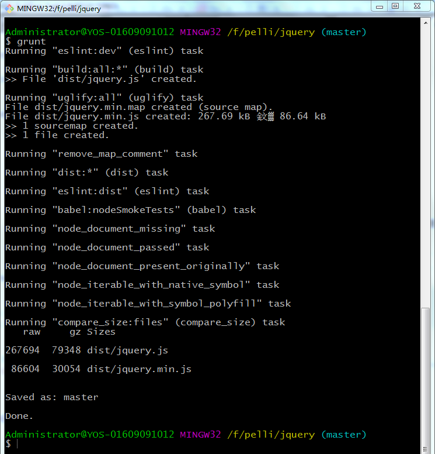
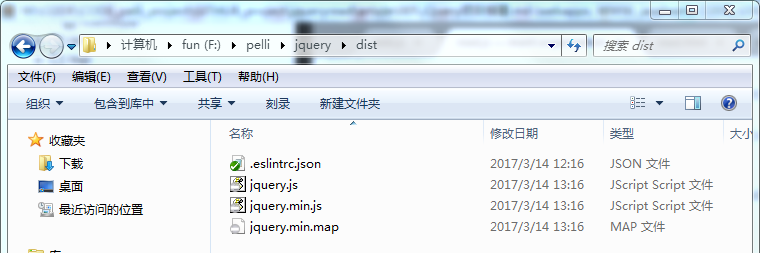

## jQuery项目搭建

> **环境准备**  
> 由于是Windows系统环境，没有好的命令行工具。这里我用gitbash。在Linux系统或者macOS中，可以直接使用终端进行操作。

1. 安装git  
2. 安装node和npm  
3. 安装grunt-cli

> **项目搭建**  

**1.从github上将项目clone下来**



```
git clone https://github.com/jquery/jquery.git
```

**2.进入源码目录(本地jQuery源码所在的目录):**

> 我的jQuery源码目录是：F:\pelli\jquery  
> 在Windows系统下，直接从资源管理器就可以进入该文件夹。  
> 进入文件夹之后，鼠标右键：Git bash here（需要系统安装git）    
> 或者，按下shift并鼠标右键：在此处打开命令行  
> 在其他系统中，比如Linux或者macOS中，可以使用终端进入目录。  

**文件夹实例**

  

**使用gitbash**  

  

**使用Windows CMD**  



**3.安装jQuery项目的依赖(在jQuery源码的根目录下)**

> 在安装过程中，可能会很慢，也可能会报错，这时候根据报错的内容，自行上网查找资料进行解决。问题不一而足，可能是版本问题，可能是系统

```
npm install
```

  
  

**4.运行项目(在jQuery源码的根目录下)**

> 我们先来看看dist目录。 
> 可以发现dist目录是空的   

  

> 我们来执行一下grunt  

```
grunt
```

  

> grunt任务执行结束，我们再来看看dist目录  

  

> 可以发现，dist目录下面多了三个文件：  
> jquery.min.js  
> jquery.js  
> jquery.min.map  
> 说明我们的jQuery项目搭建成功  

