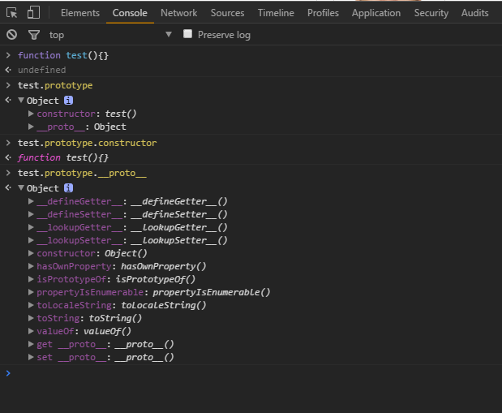
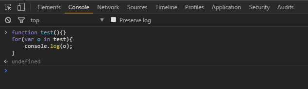

## 原型  

* 实例属性  
* 原型属性  
* 

> 无论何时我们创建一个函数，这个函数都有一个prototype属性

```javascript
function test(){}
console.log(test.prototype);
```

  

**prototype属性是哪里来的呢？**

```javascript
function test(){}

for(var o in test){
    console.log(o);
}
```

  

可以看到，test函数并没有prototype属性。