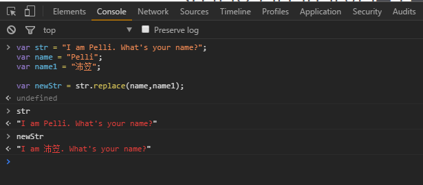
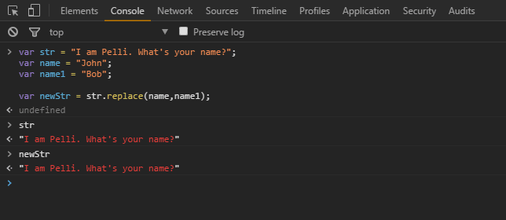
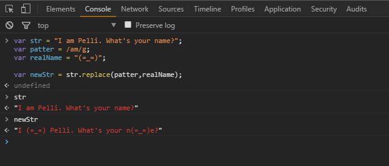
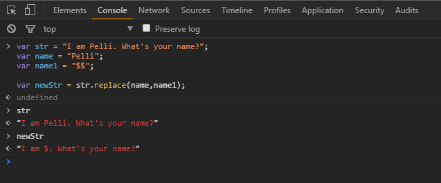

## javascript replace

> [MDN英文参考手册：replace](https://developer.mozilla.org/en-US/docs/Web/JavaScript/Reference/Global_Objects/String/replace)  
> [MDN中文参考手册：replace](https://developer.mozilla.org/zh-CN/docs/Web/JavaScript/Reference/Global_Objects/String/replace)

**参数说明**

```
str.replace(regexp|substr, newSubstr|function);
```

MDN上面显示的是有两个参数  

第一个参数是一个正则表达式或者字符串  

第二个参数是一个字符串或者一个函数  

### example1:简单替换

```javascript
var str = "I am Pelli. What's your name?";
var name = "Pelli";
var name1 = "沛笠";

var newStr = str.replace(name,name1);

console.log(str);//"I am Pelli. What's your name?"
console.log(newStr);//"I am 沛笠. What's your name?"
```

示例图片  

  

可以看到这种简单替换，不会更改原来的字符串内容。是生成新的字符串。新字符串中匹配到的字符被替换成第二个参数了。

那么，如果字符串中没有匹配到字符的话会怎么样？  

### example2:简单替换，匹配不到字符

```javascript
var str = "I am Pelli. What's your name?";
var name = "John";
var name1 = "Bob";

var newStr = str.replace(name,name1);

console.log(str);//"I am Pelli. What's your name?"
console.log(newStr);//"I am Pelli. What's your name?"
```

示例图片



可以看到，如果没有匹配到，也不会报错，字符串原样输出。

### example3:简单替换，使用正则

```javascript
var str = "I am Pelli. What's your name?";
var patter = /am/g;
var realName = "(=_=)";

var newStr = str.replace(patter,realName);

console.log(str);
console.log(newStr);
```

示例图片



通过正则表达式，可以实现忽略大小写，全局替换，多行替换等效果。

详情请查询正则表达式相关内容。

## 第二个参数：可以使用字符串，也可以使用函数

> 第二个参数使用字符串的时候，可以直接使用字符串，也可以在字符串中插入特殊的变量名：

|变量名|描述|
|:-----:|:-----|
|$$ |插入一个"$"|
|$& |插入一个匹配的子串|
|$` |插入一个匹配的子串左边的内容|
|$' |插入一个匹配的子串右边的内容|
|$n |如果n是一个小于100的非负整数，那么插入第n个括号匹配的字符串|

### example4:第二个参数，使用字符串

> 将Pelli替换成一个$

```javascript
var str = "I am Pelli. What's your name?";
var name = "Pelli";
var name1 = "$$";

var newStr = str.replace(name,name1);

console.log(str);//"I am Pelli. What's your name?"
console.log(newStr);//"I am $. What's your name?"
```

示例图片



### example5:第二个参数使用字符串

> 

### example6:第二个参数使用函数

> 你可以指定一个函数作为第二个参数，在这种情况下，当匹配执行后，该函数就会执行，函数的返回值作为替换字符串。（注意，上面提到的特殊替换字符串不能在这里使用。）另外要注意的是，如果第一个参数是正则表达式，并且其为全局匹配模式，那么这个方法将会被多次调用，每次匹配都会被调用。

